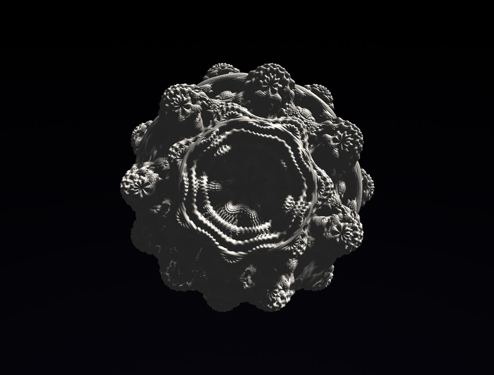

# Mandelbulb

Real-time 3D Mandelbulb renderer running in the browser.

Built from scratch with **Go + WebAssembly + TypeScript + WebGPU + WGSL**.



## Stack

* Go — core state and numerical logic
* WebAssembly — Go ↔ browser bridge
* TypeScript — application and controls
* WebGPU — GPU rendering
* WGSL — ray marching and fractal rendering
* Vite — frontend tooling

## Features

* Real-time Mandelbulb rendering
* GPU ray marching
* Adjustable fractal parameters
* Free-flight 3D camera
* Procedural lighting
* Deep zoom exploration
* Rendering diagnostics
* Presets

## Architecture

```text
TypeScript
    │
    ├── UI / input
    │
    ↓
WebAssembly
    │
    ↓
Go core
    │
    └── state / parameters
            │
            ↓
         WebGPU
            │
            ↓
          WGSL
            │
       ray marching
            │
            ↓
          pixels
```

The expensive per-pixel work is performed on the GPU. Go and WebAssembly handle application-side state and numerical logic rather than transferring rendered pixels through the WASM boundary.

## Running

Requirements:

* Go
* Node.js
* A browser with WebGPU support

```bash
git clone https://github.com/PeacexF/mandelbulb
cd mandelbulb

make wasm
npm install
npm run dev
```

Open the local development server in a WebGPU-compatible browser.

## Controls

| Key / Input | Action          |
| ----------- | --------------- |
| `W A S D`   | Move            |
| `Q / E`     | Move vertically |
| `Shift`     | Move faster     |
| Mouse       | Look            |
| `R`         | Reset camera    |

Additional controls are available in the UI.

## License

MIT
